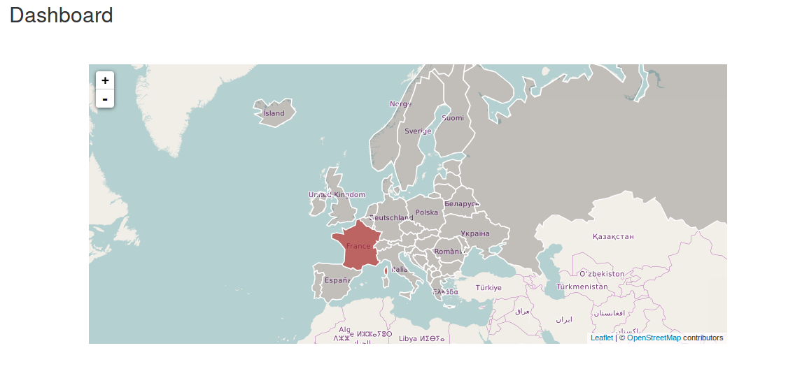
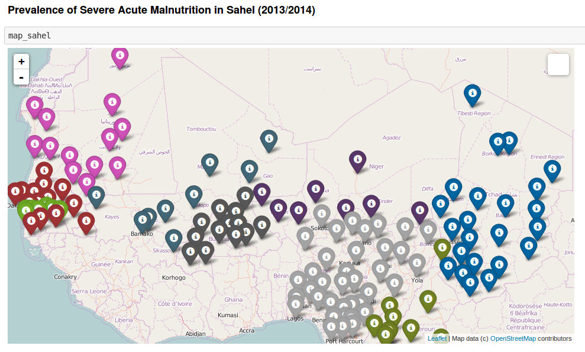
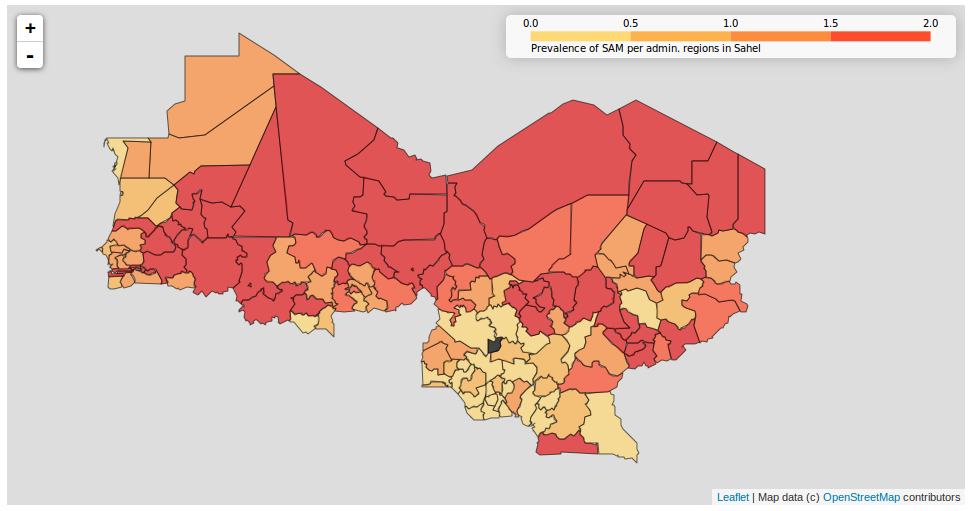
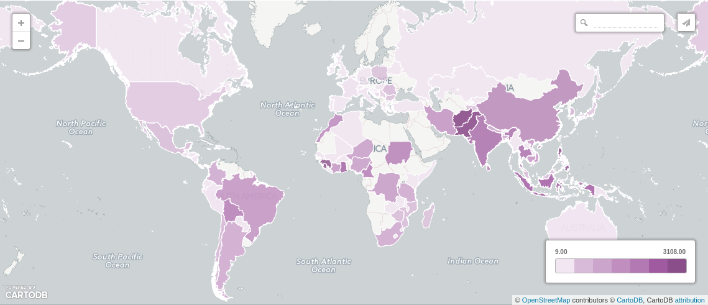
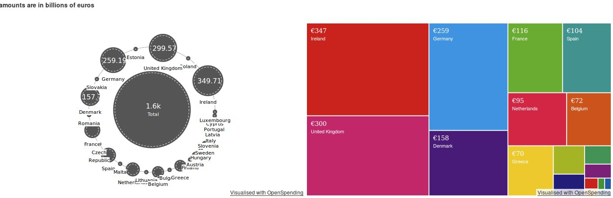

Data Visualisation
==================

D3+Leaflet
-----

Working on an interactive map visualisation using D3 and Leaflet.

Folium
-----

Visualisation of Severe Acute Malnutrition data in Sahel countries. [Notebook](http://nbviewer.ipython.org/github/Eleonore9/DataViz/blob/master/20151202_folium_SahelData/Sahel_data_folium.ipynb)

* Simple markers on a leaflet.js map with data in popup windows:

note: one colour per country

* Choropleth map with colour intensity increasing with the prevalence of malnutrition:

CartoDB
-----

Visualising of disasters that occured during the year 2014.

* Dataset from [Emergency Events Database EM-DAT](http://www.emdat.be/).
* Visualisation on [CartoDB](https://eleo.cartodb.com/viz/502524bc-c4b3-11e4-adb6-0e853d047bba/public_map)

OpenSpending by OKFN
------

Visualising financial aid crisis using an 'Open Knowledge Foundation' project called OpenSpending, using a dataset from via datahub.io.

* [Source](http://datahub.io/dataset/financial-crisis-aid/resource/809a20aa-4e1a-4ed6-921e-1b3afe10947f)
* [Visualisation 1](http://openspending.org/financial_aid/views/financial-aid-crisis#/~/total)
* [Visualisation 2](http://openspending.org/financial_aid/views/financial-crisis-aid-2)
note: amounts are in billion of euros

