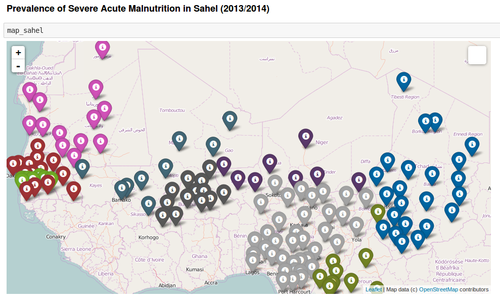

## Map visualisation with Python and Folium

#### Aim:

Visualisation of Severe Acute Malnutrition data in Sahel countries. [Notebook](http://nbviewer.jupyter.org/github/Eleonore9/DataViz/blob/master/python_folium_sahel/Sahel_data_folium.ipynb)

#### Result:

* Simple markers on a leaflet.js map with data in popup windows:

note: one colour per country

* Choropleth map with colour intensity increasing with the prevalence of malnutrition:

#### Data:

[Dataset](https://data.hdx.rwlabs.org/dataset/prevalence-of-severe-acute-malnutrition-of-sahel) from
the Humanitarian Data Exchange.

It represents the latest Severe Acute Malnutrition (SAM) Prevalence available from 2010 to 2015 for the Sahel nine countries (Burkina Faso, Cameroon, Chad, the Gambia, Mali, Mauritania, Niger, Nigeria, Senegal).
